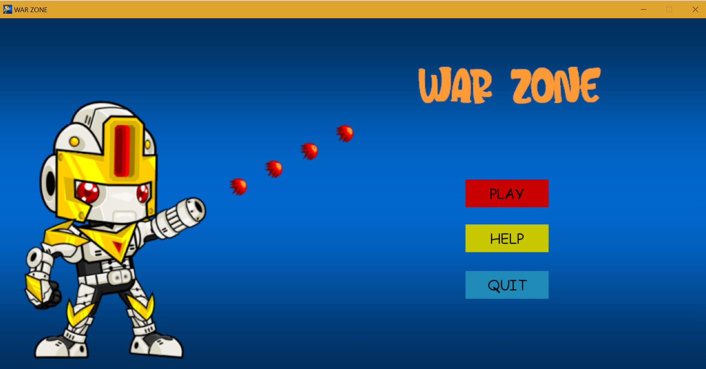
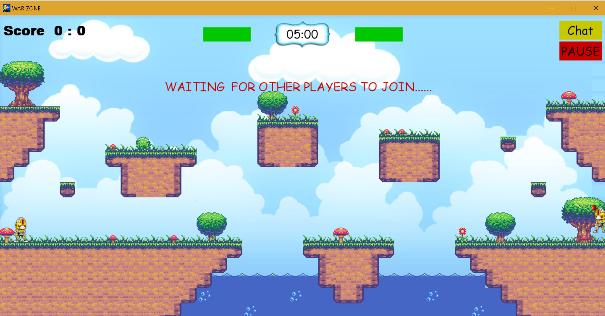
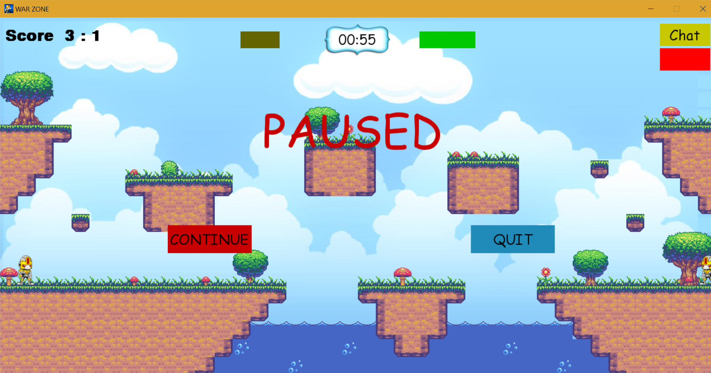
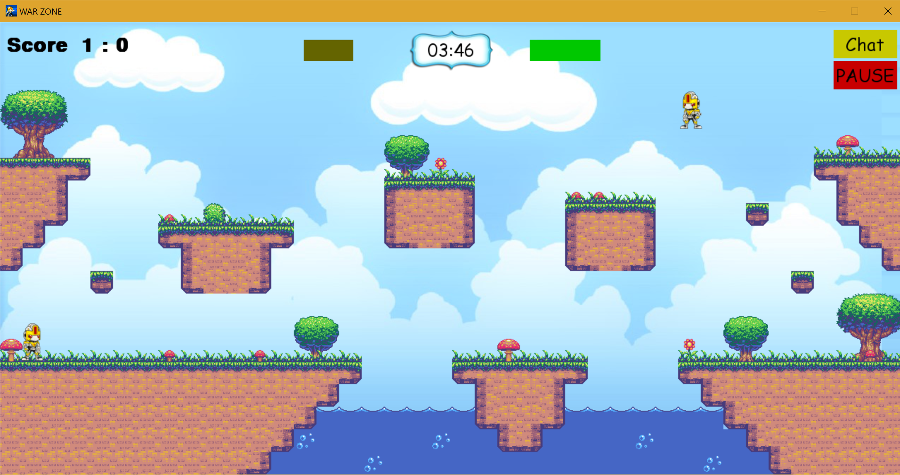
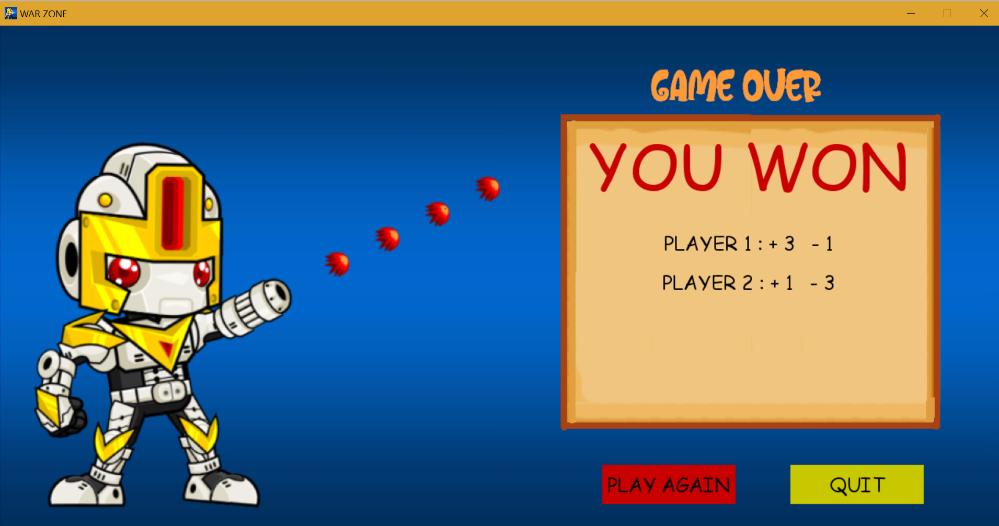

# WarZone

WarZone is basically a Multiplayer Shooting game which can be played by connecting 2 laptops via Socket Programming.
This game had many features like

Game(Timer) does not start untill everyone has joined.

You can pause the game whenever you want.

You can send the message anytime from the game screen to your opponent.
The message will be displayed on top of the screen for a few seconds.

You can use spacebar to fire.
Arrow keys to move right/left/jump.

At last scores will be shown.

Steps:

1->One computer will run the server.py file 

2->If the players are not on the same pc as server then the players have to change the value of self.host to the ip address of the server.IP address of the server can be found by running the 'ipconfig' command on the server command prompt. 

This line gives the ip address

IPv4 Address. . . . . . . . . . . : 172.31.71.138

Enter in this format
self.host='172.31.71.138'

3->Players will run Warzone.py file

NOTE:Warzone and Warzone2 are exactly same.You can run any of the file
